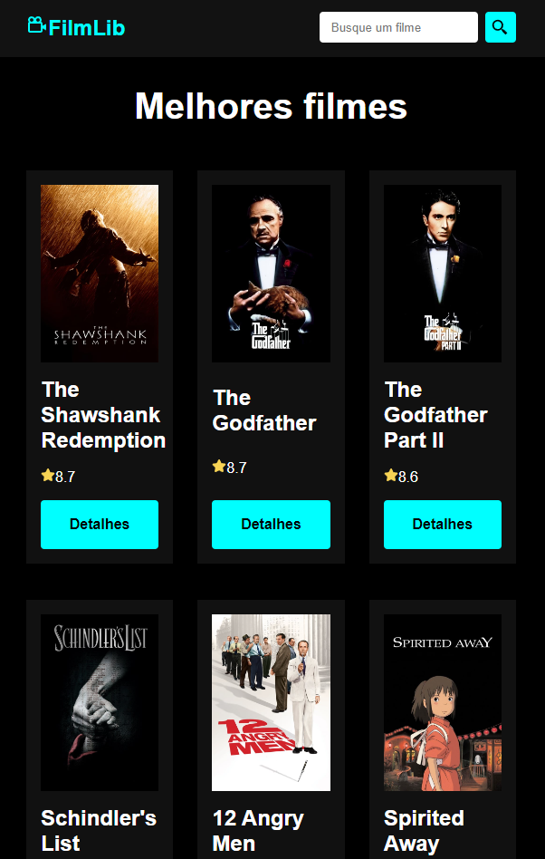
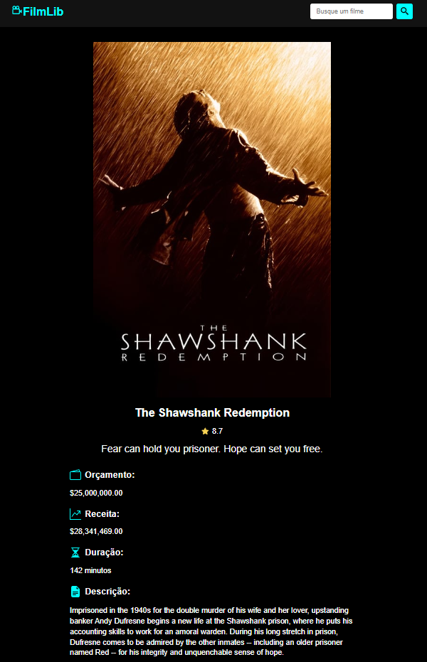

# _FilmLib - Biblioteca de Filmes_[:link: :point_left:](https://filmlib.netlify.app/)

## Características da Aplicação

- Barra de pesquisa para procurar o filme desejado.
- Página inicial expondo os melhores filmes, de acordo com o The Movie Database (TMDB).
- Filmes expostos no formato de card.
- Botão que redireciona para outra pagina, com os detalhes individuais do filme.

### Página inicial

### Detalhes individual do filme

### Tecnologias Usadas:

